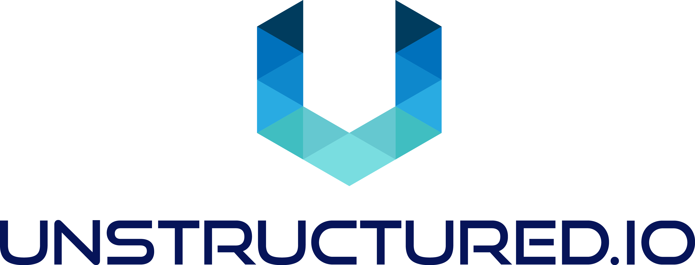

<h3 align="center">
  
</h3>

<h3 align="center">
  <p>Pre-Processing OCR Pipeline for PaddleOCR</p>
</h3>

<div align="center">

  <a href="https://github.com/Unstructured-IO/pipeline-paddleocr/blob/main/LICENSE.md"></a>
  <a href="https://pypi.python.org/pypi/unstructured/"></a>
  <a href="https://GitHub.com/unstructured-io/pipeline-paddleocr/graphs/contributors"></a>
  <a href="https://github.com/Unstructured-IO/pipeline-paddleocr/blob/main/CODE_OF_CONDUCT.md"> </a>
  <a href="https://pypi.python.org/pypi/unstructured/"></a>

</div>


This pipeline processes input image documents in the English language using [PaddleOCR](https://github.com/PaddlePaddle/PaddleOCR).
The pipeline works on `x86\_64` cpus.

## Developer Quick Start

* Using `pyenv` to manage virtualenvs is recommended
	* Mac install instructions. See [here](https://github.com/Unstructured-IO/community#mac--homebrew) for more detailed instructions.
		* `brew install pyenv-virtualenv`
	  * `pyenv install 3.8.15`
  * Linux instructions are available [here](https://github.com/Unstructured-IO/community#linux).

  * Create a virtualenv to work in and activate it, e.g. for one named `paddleocr`:

	`pyenv  virtualenv 3.8.15 paddleocr` <br />
	`pyenv activate paddleocr`

* If you are on a Mac with an M1 chip, run `brew install mupdf swig freetype` to install
  required non-Python dependencies.
* Run `make install`
* Start a local jupyter notebook server with `make run-jupyter` <br />
	**OR** <br />
	just start the fast-API locally with `make run-web-app`

### Performing OCR on a JPG image

To run OCR on a JPG image, run `make run-web-app` and run the following `curl` command,
replacing `sample-docs/sample-receipt.jpg` with your filename:

```
curl -X 'POST' \
  'http://localhost:8000/paddleocr/v0.0.1/paddleocr' \
  -H 'accept: application/json' \
  -H 'Content-Type: multipart/form-data' \
  -F 'files=@sample-docs/sample-receipt.jpg'  | jq -C . | less -R
```

The result should look like the following.

```
"{\"result\": [[[[162.0, 111.0], [429.0, 110.0], [429.0, 138.0], [162.0, 139.0]], [\"PETRON BKT
LANJAN SB\", 0.918]], [[[162.0, 142.0], [418.0, 141.0], [418.0, 170.0], [162.0, 171.0]], [\"ALSERKAM
ENTERPRISE\", 0.9785]], [[[44.0, 178.0], [562.0, 175.0], [562.0, 199.0], [44.0, 202.0]], [\"Te1
03-6156 8757 Co No 001083069-M\", 0.9282]], [[[121.0, 209.0], [467.0, 209.0], [467.0, 232.0],
[121.0, 232.0]], [\"KM 458.4 BKT LANJAN UTARA,\", 0.9205]], [[[95.0, 239.0], [484.0, 237.0], [484.0,
264.0], [95.0, 267.0]], [\"L/RAYA UTARA SELATAN,SG BULOH\", 0.9525]], [[[188.0, 270.0], [403.0,
270.0], [403.0, 298.0], [188.0, 298.0]], [\"47000 SUNGAI BUL\", 0.9704]], [[[139.0, 335.0], [443.0,
335.0], [443.0, 359.0], [139.0, 359.0]], [\"GST ID No001210736640\", 0.9619]], [[[217.0, 397.0],
[366.0, 397.0], [366.0, 424.0], [217.0, 424.0]], [\"TAX INVOICE\", 0.9886]], [[[29.0, 491.0],
[351.0, 490.0], [351.0, 518.0], [29.0, 519.0]], [\"TAX INVOICE NO 19729058\", 0.963]], [[[28.0,
523.0], [129.0, 523.0], [129.0, 552.0], [28.0, 552.0]], [\"POS1\", 0.9617]], [[[29.0, 554.0],
[272.0, 552.0], [272.0, 582.0], [29.0, 583.0]], [\"Store No.:129077\", 0.9439]], [[[492.0, 552.0],
[553.0, 552.0], [553.0, 584.0], [492.0, 584.0]], [\"Babu\", 0.9968]], [[[28.0, 586.0], [169.0,
589.0], [169.0, 618.0], [27.0, 615.0]], [\"01/02/2018\", 0.9972]], [[[162.0, 587.0], [340.0, 587.0],
[340.0, 615.0], [162.0, 615.0]], [\"4:43:17PM\", 0.8981]], [[[28.0, 683.0], [311.0, 683.0], [311.0,
711.0], [28.0, 711.0]], [\"A 2 doublemint te\", 0.9652]], [[[506.0, 679.0], [566.0, 679.0], [566.0,
710.0], [506.0, 710.0]], [\"3.00\", 0.9931]], [[[25.0, 714.0], [313.0, 712.0], [314.0, 742.0],
[25.0, 743.0]], [\"A1sandwich vanill\", 0.9318]], [[[507.0, 711.0], [566.0, 711.0], [566.0, 743.0],
[507.0, 743.0]], [\"1.90\", 0.9937]], [[[69.0, 778.0], [165.0, 778.0], [165.0, 807.0], [69.0,
807.0]], [\"GST RM\", 0.9119]], [[[505.0, 775.0], [566.0, 775.0], [566.0, 807.0], [505.0, 807.0]],
[\"0.28\", 0.9929]], [[[70.0, 811.0], [296.0, 811.0], [296.0, 839.0], [70.0, 839.0]], [\"Total RM
inc.GST:\", 0.9176]], [[[506.0, 807.0], [566.0, 807.0], [566.0, 839.0], [506.0, 839.0]], [\"4.90\",
0.9949]], [[[67.0, 873.0], [128.0, 873.0], [128.0, 905.0], [67.0, 905.0]], [\"Cash\", 0.9938]],
[[[505.0, 868.0], [568.0, 868.0], [568.0, 905.0], [505.0, 905.0]], [\"5.00\", 0.992]], [[[67.0,
904.0], [154.0, 908.0], [153.0, 938.0], [66.0, 935.0]], [\"Change\", 0.9971]], [[[506.0, 903.0],
[566.0, 903.0], [566.0, 935.0], [506.0, 935.0]], [\"0.10\", 0.9981]], [[[29.0, 968.0], [179.0,
973.0], [178.0, 1002.0], [29.0, 998.0]], [\"GsT Summary\", 0.8839]], [[[242.0, 969.0], [387.0,
966.0], [388.0, 996.0], [242.0, 999.0]], [\"AnountRM\", 0.895]], [[[454.0, 969.0], [562.0, 969.0],
[562.0, 998.0], [454.0, 998.0]], [\"Tax (RM)\", 0.8915]], [[[29.0, 1002.0], [128.0, 1002.0], [128.0,
1033.0], [29.0, 1033.0]], [\"A=6.00%\", 0.9756]], [[[241.0, 1001.0], [301.0, 1001.0], [301.0,
1033.0], [241.0, 1033.0]], [\"4.62\", 0.9949]], [[[452.0, 999.0], [513.0, 999.0], [513.0, 1031.0],
[452.0, 1031.0]], [\"0.28\", 0.9955]], [[[29.0, 1070.0], [47.0, 1070.0], [47.0, 1092.0], [29.0,
1092.0]], [\"A\", 0.9864]], [[[106.0, 1066.0], [418.0, 1066.0], [418.0, 1094.0], [106.0, 1094.0]],
[\"ITAL INCLUDES 6.00%GST\", 0.9485]], [[[151.0, 1166.0], [429.0, 1166.0], [429.0, 1190.0], [151.0,
1190.0]], [\"Use 3000 Petron Miles\", 0.9395]], [[[176.0, 1197.0], [403.0, 1194.0], [403.0, 1223.0],
[176.0, 1226.0]], [\"points to pay for\", 0.9474]], [[[228.0, 1227.0], [351.0, 1227.0], [351.0,
1257.0], [228.0, 1257.0]], [\"RM45 Fue1\", 0.932]]]}
```

You can also run OCR through the Python API using the following commands:

```python
from prepline_paddleocr.api.paddleocr import pipeline_api

filename = "sample-docs/sample-receipt.jpg"

with open(filename, "rb") as f:
    pipeline_api(file=f)
```


### Generating Python files from the pipeline notebooks

You can generate the FastAPI APIs from your pipeline notebooks by running `make generate-api`.

## Security Policy

See our [security policy](https://github.com/Unstructured-IO/pipeline-paddleocr/security/policy) for
information on how to report security vulnerabilities.

## Learn more

| Section | Description |
|-|-|
| [Unstructured Community Github](https://github.com/Unstructured-IO/community) | Information about Unstructured.io community projects  |
| [Unstructured Github](https://github.com/Unstructured-IO) | Unstructured.io open source repositories |
| [Company Website](https://unstructured.io) | Unstructured.io product and company info |
